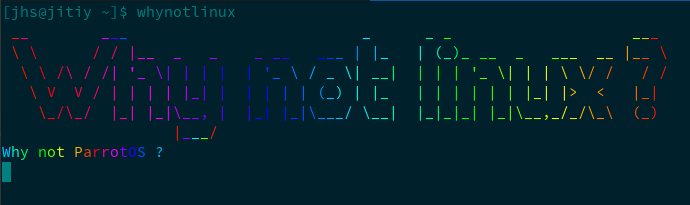

# whynotlinux
À l'occasion de l'evenement **why not linux ?** qui se tiendra le 29 avril 2023 à l'ESTI Antanimena, 
`whynotlinux` est une CLI avec une animation.


- [ ] **Installation**
```Bash
    $ ~ git clone https://github.com/lahatra3/whynotlinux.git
    $ ~ cd whynotlinux
    $ ~ npm i -g
```
Maintenant, vous avez le `whynotlinux` CLI installer. 

Happy coding 😊 !

 <p align="center">
      <a href="https://github.com/lahatra3/whynotlinux">
          
      </a>
  </p>
